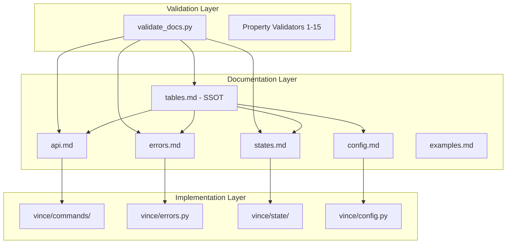

# Design Document: Integration Validation

## Overview

This design specifies the implementation approach for validating the coherence between the vince CLI documentation system, source code, and validation tooling. The primary goals are:

1. Fix unused variables in `validate_docs.py` by implementing their intended functionality
2. Fix unused imports in source code by utilizing them appropriately
3. Ensure bidirectional consistency between documentation and implementation
4. Provide comprehensive property-based testing for validation logic

## Architecture

The integration validation system consists of three interconnected layers:



## Components and Interfaces

### Component 1: Pattern Usage Enhancement (validate_docs.py)

The following unused patterns need to be integrated into the validation logic:

#### 1.1 return_type_pattern (Line 1042)

```python
# Current (unused):
return_type_pattern = re.compile(r"####\s+Return\s+Type")

# Enhanced usage in validate_api_completeness():
def validate_api_completeness(content: str, filename: str) -> ValidationResult:
    # ... existing code ...
    
    # Use return_type_pattern for more precise detection
    for line_num, line in enumerate(lines, 1):
        if return_type_pattern.match(stripped):
            if current_command:
                documented_commands[current_command]["has_return_type"] = True
```

#### 1.2 exceptions_pattern (Line 1043)

```python
# Current (unused):
exceptions_pattern = re.compile(r"####\s+Raised\s+Exceptions")

# Enhanced usage in validate_api_completeness():
def validate_api_completeness(content: str, filename: str) -> ValidationResult:
    # ... existing code ...
    
    # Use exceptions_pattern for more precise detection
    for line_num, line in enumerate(lines, 1):
        if exceptions_pattern.match(stripped):
            if current_command:
                documented_commands[current_command]["has_exceptions"] = True
```

#### 1.3 example_section_pattern (Line 1174)

```python
# Current (unused):
example_section_pattern = re.compile(r"^###\s+Example", re.IGNORECASE)

# Enhanced usage in validate_schema_completeness():
def validate_schema_completeness(content: str, filename: str) -> ValidationResult:
    # ... existing code ...
    
    # Use example_section_pattern to detect example sections
    example_match = example_section_pattern.match(stripped)
    if example_match and current_schema:
        # Mark that we're in an example section for this schema
        in_example_section = True
```

#### 1.4 transition_section_pattern (Line 1473)

```python
# Current (unused):
transition_section_pattern = re.compile(
    r"^###\s+(\w+)\s+State\s+Transitions", re.IGNORECASE
)

# Enhanced usage in validate_state_transitions():
def validate_state_transitions(content: str, filename: str) -> ValidationResult:
    # ... existing code ...
    
    # Use transition_section_pattern to detect transition sections
    trans_match = transition_section_pattern.match(stripped)
    if trans_match:
        current_transition_section = trans_match.group(1).lower()
        in_transition_table = False
```

### Component 2: Import Utilization (vince/commands/reject.py)

The `print_warning` import needs to be utilized for appropriate warning scenarios:

```python
# In cmd_reject(), add warning for offers that have been used:
def cmd_reject(
    offer_id: str,
    complete_delete: bool,
    verbose: bool,
) -> None:
    # ... existing code ...
    
    # Add warning when rejecting an active offer
    if existing_offer["state"] == "active":
        print_warning(
            f"Offer [offer]{offer_id}[/] has been used. "
            "Consider if dependent workflows need updating."
        )
    
    # Add warning for complete delete
    if complete_delete and verbose:
        print_warning(
            f"Complete delete will permanently remove [offer]{offer_id}[/] "
            "from the data file."
        )
```

### Component 3: Cross-Reference Validation Enhancement

Add bidirectional validation between documentation and source code:

```python
# New function in validate_docs.py
def validate_code_documentation_sync(
    docs_dir: Path,
    src_dir: Path,
) -> ValidationResult:
    """
    Validate bidirectional consistency between docs and source code.
    
    Checks:
    1. All documented commands have implementations
    2. All implemented commands are documented
    3. All documented errors have exception classes
    4. All exception classes are documented
    5. All documented states have implementations
    6. All implemented states are documented
    """
    result = ValidationResult()
    
    # Extract from documentation
    doc_commands = extract_commands_from_api(docs_dir / "api.md")
    doc_errors = extract_errors_from_errors_md(docs_dir / "errors.md")
    doc_states = extract_states_from_states_md(docs_dir / "states.md")
    
    # Extract from source code
    src_commands = extract_commands_from_source(src_dir / "commands")
    src_errors = extract_errors_from_source(src_dir / "errors.py")
    src_states = extract_states_from_source(src_dir / "state")
    
    # Validate bidirectional consistency
    for cmd in doc_commands - src_commands:
        result.add_error("sync", None, "DOC-CODE", 
            f"Command '{cmd}' documented but not implemented")
    
    for cmd in src_commands - doc_commands:
        result.add_error("sync", None, "CODE-DOC",
            f"Command '{cmd}' implemented but not documented")
    
    # Similar checks for errors and states...
    
    return result
```

## Data Models

### ValidationResult Enhancement

```python
@dataclass
class ValidationResult:
    """Enhanced validation result with categorization."""
    
    errors: list[ValidationError] = field(default_factory=list)
    warnings: list[ValidationError] = field(default_factory=list)
    
    # New: Track validation coverage
    files_validated: set[str] = field(default_factory=set)
    properties_checked: set[str] = field(default_factory=set)
    
    def add_error(self, file: str, line: Optional[int], rule: str, message: str):
        self.errors.append(ValidationError(file, line, rule, message, "error"))
    
    def add_warning(self, file: str, line: Optional[int], rule: str, message: str):
        self.warnings.append(ValidationError(file, line, rule, message, "warning"))
    
    def mark_file_validated(self, filepath: str):
        self.files_validated.add(filepath)
    
    def mark_property_checked(self, property_name: str):
        self.properties_checked.add(property_name)
```

## Correctness Properties

*A property is a characteristic or behavior that should hold true across all valid executions of a system—essentially, a formal statement about what the system should do. Properties serve as the bridge between human-readable specifications and machine-verifiable correctness guarantees.*

### Property 1: Pattern Definition-Usage Consistency

*For any* regex pattern variable defined in validate_docs.py, if the pattern is assigned a compiled regex, then that pattern variable SHALL be referenced in at least one validation function.

**Validates: Requirements 1.1, 1.2, 1.3, 1.4, 1.5**

### Property 2: Import Usage Completeness

*For any* import statement in a Python source file in `vince/`, the imported name SHALL be referenced at least once in that file's code (excluding comments and strings).

**Validates: Requirements 2.1, 2.2**

### Property 3: Documentation-to-Code Mapping

*For any* command/error/state defined in the documentation system, there SHALL exist a corresponding implementation in the source code with matching identifier.

**Validates: Requirements 3.1, 3.2, 3.3, 3.4, 6.1, 7.1**

### Property 4: Code-to-Documentation Mapping

*For any* command/error/state implemented in the source code, there SHALL exist a corresponding entry in the documentation with matching identifier.

**Validates: Requirements 6.3, 7.3**

### Property 5: Cross-Reference Integrity

*For any* identifier referenced in one documentation file that should be defined in tables.md, that identifier SHALL exist in the appropriate table in tables.md.

**Validates: Requirements 4.1, 4.2, 4.3, 4.4**

### Property 6: Validation Coverage

*For any* markdown file in the `docs/` directory, the validation script SHALL process that file and include it in the validation report.

**Validates: Requirements 5.1, 5.3**

### Property 7: Error Condition Handling

*For any* error condition defined in the error catalog, when that condition is triggered in the source code, the appropriate VinceError subclass SHALL be raised with the correct error code.

**Validates: Requirements 6.2**

### Property 8: State Transition Validation

*For any* state transition not in the valid transitions set, attempting that transition SHALL raise an appropriate error.

**Validates: Requirements 7.2**

## Error Handling

### Validation Errors

| Error Type | Handling Strategy |
|------------|-------------------|
| Missing file | Add error to result, continue validation |
| Parse error | Add error with line number, skip section |
| Cross-ref failure | Add error with both source and target |
| Pattern mismatch | Add warning, suggest correction |

### Source Code Errors

| Error Type | Handling Strategy |
|------------|-------------------|
| Unused import | Implement usage or document removal |
| Unused variable | Implement usage in validation logic |
| Missing implementation | Add stub or document as TODO |

## Testing Strategy

### Dual Testing Approach

The testing strategy combines:
- **Unit tests**: Verify specific examples and edge cases
- **Property tests**: Verify universal properties across generated inputs

### Property-Based Testing Configuration

- **Framework**: Hypothesis
- **Minimum iterations**: 100 per property test
- **Tag format**: `Feature: integration-validation, Property {N}: {description}`

### Test Categories

#### 1. Pattern Usage Tests

```python
# tests/test_validate_docs_patterns.py
from hypothesis import given, settings
from hypothesis import strategies as st

class TestPatternUsage:
    @given(st.text(min_size=1, max_size=100))
    @settings(max_examples=100)
    def test_return_type_pattern_matches_valid_sections(self, section_name):
        """
        Feature: integration-validation, Property 1: Pattern Definition-Usage
        For any valid return type section header, the pattern should match.
        """
        header = f"#### Return Type"
        assert return_type_pattern.match(header)
```

#### 2. Import Usage Tests

```python
# tests/test_import_usage.py
import ast
from pathlib import Path

class TestImportUsage:
    def test_all_imports_used_in_reject_command(self):
        """
        Feature: integration-validation, Property 2: Import Usage
        All imports in reject.py should be used.
        """
        source = Path("vince/commands/reject.py").read_text()
        tree = ast.parse(source)
        
        imports = extract_imports(tree)
        usages = extract_name_usages(tree)
        
        for imp in imports:
            assert imp in usages, f"Import '{imp}' is unused"
```

#### 3. Cross-Reference Tests

```python
# tests/test_cross_references.py
class TestCrossReferences:
    @given(valid_error_codes())
    @settings(max_examples=100)
    def test_error_codes_in_tables(self, error_code):
        """
        Feature: integration-validation, Property 5: Cross-Reference Integrity
        For any error code in errors.md, it should exist in tables.md.
        """
        tables_errors = extract_errors_from_tables(tables_content)
        assert error_code in tables_errors
```

#### 4. Validation Coverage Tests

```python
# tests/test_validation_coverage.py
class TestValidationCoverage:
    def test_all_doc_files_validated(self):
        """
        Feature: integration-validation, Property 6: Validation Coverage
        All markdown files in docs/ should be validated.
        """
        docs_dir = Path("docs")
        all_md_files = set(f.name for f in docs_dir.glob("*.md"))
        
        result = validate_all_docs(docs_dir)
        
        assert result.files_validated >= all_md_files
```

### Test File Structure

```
tests/
├── test_validate_docs_patterns.py    # Property 1 tests
├── test_import_usage.py              # Property 2 tests
├── test_doc_code_sync.py             # Properties 3, 4 tests
├── test_cross_references.py          # Property 5 tests
├── test_validation_coverage.py       # Property 6 tests
├── test_error_handling.py            # Property 7 tests
├── test_state_transitions.py         # Property 8 tests (existing)
└── conftest.py                       # Shared fixtures
```

