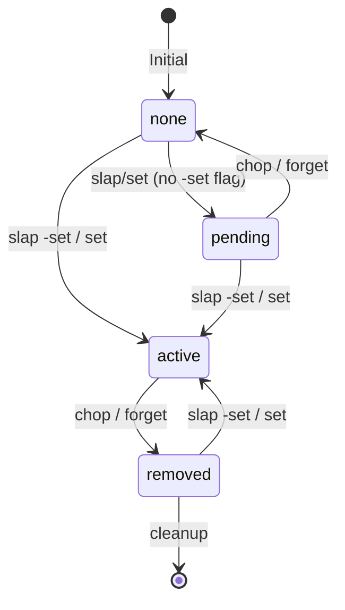
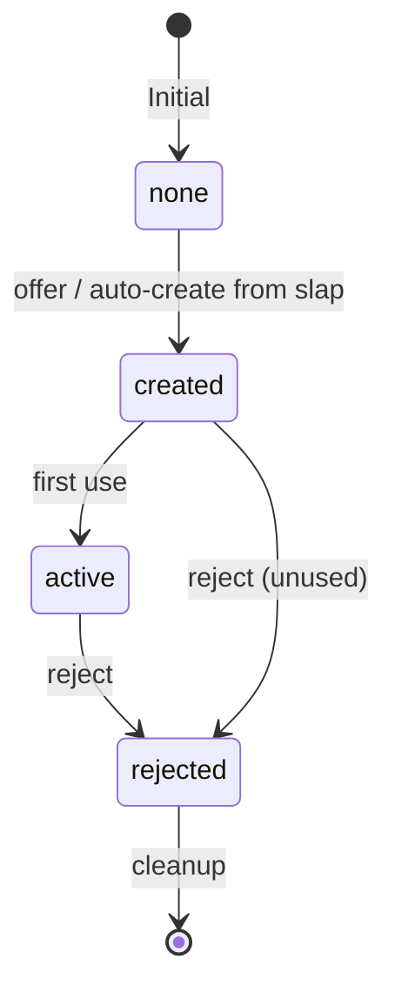

# Design Document: Python Integration Preparation

## Overview

This design specifies the comprehensive documentation expansion required to prepare the `vince` CLI for Python implementation. The documentation will serve as a complete blueprint covering API interfaces, data models, error handling, configuration, state machines, persistence, validation, output formatting, and testing patterns.

The design follows the established documentation architecture where `tables.md` remains the Single Source of Truth (SSOT), with new specialized documents for each domain area.

## Architecture

```
┌────────────────────────────────────────────────────────────────────────────┐
│                    EXPANDED DOCUMENTATION SYSTEM                           │
├────────────────────────────────────────────────────────────────────────────┤
│                                                                            │
│  ┌─────────────┐    ┌─────────────┐    ┌─────────────┐    ┌─────────────┐  │
│  │  README.md  │    │ overview.md │    │ examples.md │    │  tables.md  │  │
│  │  (Entry)    │    │  (Design)   │    │  (Usage)    │    │   (SSOT)    │  │
│  └──────┬──────┘    └──────┬──────┘    └──────┬──────┘    └──────┬──────┘  │
│         │                  │                  │                  │         │
│         └──────────────────┼──────────────────┼──────────────────┘         │
│                            │                  │                            │
│  ┌─────────────────────────┼──────────────────┼─────────────────────────┐  │
│  │                    NEW DOCUMENTS                                     │  │
│  │                                                                      │  │
│  │  ┌─────────────┐    ┌─────────────┐    ┌─────────────┐               │  │
│  │  │   api.md    │    │ schemas.md  │    │  errors.md  │               │  │
│  │  │ (Interfaces)│    │(Data Models)│    │  (Catalog)  │               │  │
│  │  └─────────────┘    └─────────────┘    └─────────────┘               │  │
│  │                                                                      │  │
│  │  ┌─────────────┐    ┌─────────────┐    ┌─────────────┐               │  │
│  │  │  config.md  │    │  states.md  │    │ testing.md  │               │  │
│  │  │(Config Opts)│    │(State Mach.)│    │(Test Patt.) │               │  │
│  │  └─────────────┘    └─────────────┘    └─────────────┘               │  │
│  │                                                                      │  │
│  └──────────────────────────────────────────────────────────────────────┘  │
│                                                                            │
└────────────────────────────────────────────────────────────────────────────┘
```

### New Document Responsibilities

| Document | Responsibility | Contains |
|----------|---------------|----------|
| api.md | API Interface Spec | Function signatures, parameters, returns, exceptions |
| schemas.md | Data Model Spec | JSON schemas for defaults, offers, config |
| errors.md | Error Catalog | Error codes, messages, severity, recovery |
| config.md | Configuration Spec | Config options, hierarchy, precedence |
| states.md | State Machine Spec | Lifecycle states, transitions, diagrams |
| testing.md | Testing Patterns | Fixtures, mocks, generators, examples |

## Components and Interfaces

### Component 1: API Interface Specification

Each command function follows a consistent interface pattern for Typer integration:

```python
from typing import Optional, List
from pathlib import Path
from typer import Typer, Option, Argument

app = Typer()

@app.command()
def slap(
    path: Path = Argument(..., help="Path to application executable"),
    extension: Optional[str] = Option(None, "--md", "--py", help="File extension"),
    set_default: bool = Option(False, "-set", help="Set as default"),
    verbose: bool = Option(False, "-vb", "--verbose", help="Verbose output"),
) -> None:
    """Set an application as the default for a file extension."""
    ...
```

**Command Interface Registry:**

| Command | Function | Parameters | Returns | Raises |
|---------|----------|------------|---------|--------|
| slap | `cmd_slap()` | path, extension, set_default, verbose | None | VE101, VE201, VE301 |
| chop | `cmd_chop()` | extension, forget, verbose | None | VE102, VE202, VE302 |
| set | `cmd_set()` | path, extension, verbose | None | VE101, VE201, VE301 |
| forget | `cmd_forget()` | extension, verbose | None | VE102, VE302 |
| offer | `cmd_offer()` | offer_id, path, extension, verbose | None | VE103, VE201, VE303 |
| reject | `cmd_reject()` | offer_id, complete_delete, verbose | None | VE104, VE304 |
| list | `cmd_list()` | subsection, extension, verbose | None | VE105 |

### Component 2: Data Model Schemas

**2.1 Defaults Schema (defaults.json)**

```json
{
  "$schema": "http://json-schema.org/draft-07/schema#",
  "title": "Vince Defaults",
  "type": "object",
  "properties": {
    "version": {
      "type": "string",
      "pattern": "^\\d+\\.\\d+\\.\\d+$",
      "description": "Schema version"
    },
    "defaults": {
      "type": "array",
      "items": {
        "$ref": "#/definitions/DefaultEntry"
      }
    }
  },
  "required": ["version", "defaults"],
  "definitions": {
    "DefaultEntry": {
      "type": "object",
      "properties": {
        "id": { "type": "string", "minLength": 1 },
        "extension": { "type": "string", "pattern": "^\\.[a-z0-9]+$" },
        "application_path": { "type": "string", "minLength": 1 },
        "state": { "type": "string", "enum": ["pending", "active", "removed"] },
        "created_at": { "type": "string", "format": "date-time" },
        "updated_at": { "type": "string", "format": "date-time" }
      },
      "required": ["id", "extension", "application_path", "state", "created_at"]
    }
  }
}
```

**2.2 Offers Schema (offers.json)**

```json
{
  "$schema": "http://json-schema.org/draft-07/schema#",
  "title": "Vince Offers",
  "type": "object",
  "properties": {
    "version": { "type": "string", "pattern": "^\\d+\\.\\d+\\.\\d+$" },
    "offers": {
      "type": "array",
      "items": { "$ref": "#/definitions/OfferEntry" }
    }
  },
  "required": ["version", "offers"],
  "definitions": {
    "OfferEntry": {
      "type": "object",
      "properties": {
        "offer_id": { "type": "string", "pattern": "^[a-z][a-z0-9_-]{0,31}$" },
        "default_id": { "type": "string" },
        "state": { "type": "string", "enum": ["created", "active", "rejected"] },
        "auto_created": { "type": "boolean" },
        "created_at": { "type": "string", "format": "date-time" }
      },
      "required": ["offer_id", "default_id", "state", "created_at"]
    }
  }
}
```

**2.3 Config Schema (config.json)**

```json
{
  "$schema": "http://json-schema.org/draft-07/schema#",
  "title": "Vince Configuration",
  "type": "object",
  "properties": {
    "version": { "type": "string" },
    "data_dir": { "type": "string", "default": "~/.vince" },
    "verbose": { "type": "boolean", "default": false },
    "color_theme": { "type": "string", "enum": ["default", "dark", "light"], "default": "default" },
    "backup_enabled": { "type": "boolean", "default": true },
    "max_backups": { "type": "integer", "minimum": 0, "maximum": 100, "default": 5 }
  },
  "required": ["version"]
}
```

### Component 3: Error Catalog

**Error Code Format:** `VE{category}{number}` where:
- Category: 1=Input, 2=File, 3=State, 4=Config, 5=System
- Number: 01-99 within category

**Error Categories:**

| Range | Category | Description |
|-------|----------|-------------|
| VE1xx | Input | Invalid user input errors |
| VE2xx | File | File system operation errors |
| VE3xx | State | Invalid state transition errors |
| VE4xx | Config | Configuration errors |
| VE5xx | System | System-level errors |

**Error Registry:**

| Code | Message Template | Severity | Recovery Action |
|------|-----------------|----------|-----------------|
| VE101 | Invalid path: {path} does not exist | error | Verify the application path exists |
| VE102 | Invalid extension: {ext} is not supported | error | Use a supported extension (--md, --py, etc.) |
| VE103 | Invalid offer_id: {id} does not match pattern | error | Use lowercase alphanumeric with hyphens/underscores |
| VE104 | Offer not found: {id} does not exist | error | Use `list -off` to see available offers |
| VE105 | Invalid list subsection: {section} | error | Use -app, -cmd, -ext, -def, -off, or -all |
| VE201 | File not found: {path} | error | Check file path and permissions |
| VE202 | Permission denied: cannot access {path} | error | Check file permissions |
| VE203 | Data file corrupted: {file} | error | Restore from backup or delete and recreate |
| VE301 | Default already exists for {ext} | warning | Use `chop` to remove existing default first |
| VE302 | No default set for {ext} | warning | Use `slap` or `set` to create a default |
| VE303 | Offer already exists: {id} | warning | Use a different offer_id or reject existing |
| VE304 | Cannot reject: offer {id} is in use | error | Remove dependencies before rejecting |
| VE401 | Invalid config option: {key} | error | Check config.md for valid options |
| VE402 | Config file malformed: {file} | error | Fix JSON syntax or restore default config |
| VE501 | Unexpected error: {message} | error | Report issue with error details |

### Component 4: Configuration System

**Config File Hierarchy (precedence low to high):**

1. **Default** - Built-in defaults in code
2. **User** - `~/.vince/config.json`
3. **Project** - `./.vince/config.json`

**Configuration Options:**

| Option | Type | Default | Description |
|--------|------|---------|-------------|
| data_dir | string | ~/.vince | Data storage directory |
| verbose | boolean | false | Enable verbose output by default |
| color_theme | enum | default | Console color theme (default/dark/light) |
| backup_enabled | boolean | true | Enable automatic backups |
| max_backups | integer | 5 | Maximum backup files to retain |
| confirm_destructive | boolean | true | Require confirmation for destructive ops |

### Component 5: State Machines

**5.1 Default Lifecycle:**



**Default States:**

| State | Description | Valid Transitions |
|-------|-------------|-------------------|
| none | No default exists | → pending, → active |
| pending | Default identified but not set | → active, → none |
| active | Default is set and active | → removed |
| removed | Default was removed | → active, → cleanup |

**5.2 Offer Lifecycle:**



**Offer States:**

| State | Description | Valid Transitions |
|-------|-------------|-------------------|
| none | No offer exists | → created |
| created | Offer created but not used | → active, → rejected |
| active | Offer has been used | → rejected |
| rejected | Offer was rejected | → cleanup |

### Component 6: Persistence Layer

**File I/O Pattern:**

```python
def atomic_write(path: Path, data: dict) -> None:
    """Write data atomically using temp file + rename."""
    temp_path = path.with_suffix('.tmp')
    try:
        with open(temp_path, 'w') as f:
            json.dump(data, f, indent=2)
        temp_path.rename(path)
    except Exception:
        temp_path.unlink(missing_ok=True)
        raise
```

**Backup Strategy:**
- Before each write, copy current file to `{filename}.{timestamp}.bak`
- Retain up to `max_backups` backup files
- Oldest backups are deleted when limit exceeded

**File Locations:**

| File | Location | Purpose |
|------|----------|---------|
| defaults.json | {data_dir}/defaults.json | Default associations |
| offers.json | {data_dir}/offers.json | Custom offers |
| config.json | {data_dir}/config.json | User configuration |
| *.bak | {data_dir}/backups/ | Backup files |

### Component 7: Validation Rules

**Path Validation:**

| Rule | Pattern/Check | Error Code |
|------|---------------|------------|
| Exists | `Path.exists()` | VE101 |
| Is File | `Path.is_file()` | VE101 |
| Executable | `os.access(path, os.X_OK)` | VE202 |
| Absolute | Convert relative to absolute | - |

**Extension Validation:**

| Rule | Pattern | Error Code |
|------|---------|------------|
| Format | `^\.[a-z0-9]+$` | VE102 |
| Supported | In FILE_TYPES table | VE102 |
| Lowercase | Auto-convert to lowercase | - |

**Offer ID Validation:**

| Rule | Pattern | Error Code |
|------|---------|------------|
| Format | `^[a-z][a-z0-9_-]{0,31}$` | VE103 |
| Unique | Not in existing offers | VE303 |
| Reserved | Not in reserved names list | VE103 |

**Reserved Offer Names:** `help`, `version`, `list`, `all`, `none`, `default`

### Component 8: CLI Output Formatting

**Rich Theme:**

```python
VINCE_THEME = Theme({
    "info": "cyan",
    "success": "green",
    "warning": "yellow",
    "error": "red bold",
    "command": "magenta",
    "path": "blue underline",
    "extension": "cyan bold",
})
```

**Table Format:**

```python
table = Table(title="Defaults", box=box.ROUNDED)
table.add_column("Extension", style="extension")
table.add_column("Application", style="path")
table.add_column("State", style="info")
```

**Message Formats:**

| Type | Format | Example |
|------|--------|---------|
| Success | `[success]✓[/] {message}` | ✓ Default set for .md |
| Warning | `[warning]⚠[/] {message}` | ⚠ Default already exists |
| Error | `[error]✗[/] {message}` | ✗ Invalid path |
| Info | `[info]ℹ[/] {message}` | ℹ Use -vb for details |

## Data Models

### Definition Entry Model (Extended)

```python
@dataclass
class Definition:
    id: str           # Full identifier
    sid: str          # Short identifier
    rid: str          # Rule identifier
    description: str  # Human-readable description
    category: str     # Category (command, flag, state, error, config)
```

### Error Entry Model

```python
@dataclass
class ErrorEntry:
    code: str              # Error code (VE###)
    category: str          # Category (Input, File, State, Config, System)
    message_template: str  # Message with {placeholders}
    severity: str          # error, warning, info
    recovery_action: str   # User guidance
```

### State Entry Model

```python
@dataclass
class StateEntry:
    id: str                    # State identifier
    entity: str                # Entity type (default, offer)
    description: str           # State description
    valid_transitions: List[str]  # List of valid next states
```

### Config Option Model

```python
@dataclass
class ConfigOption:
    key: str           # Option key
    type: str          # Type (string, boolean, integer, enum)
    default: Any       # Default value
    description: str   # Option description
    constraints: dict  # Validation constraints
```

## Correctness Properties

*A property is a characteristic or behavior that should hold true across all valid executions of a system—essentially, a formal statement about what the system should do. Properties serve as the bridge between human-readable specifications and machine-verifiable correctness guarantees.*

### Property 1: API Documentation Completeness

*For any* command defined in the system, the api.md document SHALL contain a complete function specification including: function signature with type hints, all parameters with types and descriptions, return type documentation, and raised exceptions with conditions.

**Validates: Requirements 1.1, 1.2, 1.3, 1.4**

### Property 2: Schema Completeness

*For any* JSON schema defined in schemas.md, it SHALL contain: all required and optional field definitions with types, validation constraints (min/max, patterns, enums), and at least one example JSON document.

**Validates: Requirements 2.4, 2.5, 2.7**

### Property 3: Error Catalog Completeness

*For any* error code defined in errors.md, it SHALL: follow the VE### format, include a message template and severity level, include a recovery action, and fall within its category's code range (VE1xx for Input, VE2xx for File, etc.).

**Validates: Requirements 3.1, 3.3, 3.4, 3.5**

### Property 4: State Transition Completeness

*For any* state transition documented in states.md, it SHALL include: the triggering command, transition conditions, resulting state, and any side effects.

**Validates: Requirements 5.3, 5.4**

### Property 5: Validation Rule Completeness

*For any* command argument documented in the system, the validation documentation SHALL include: validation rules and corresponding error messages for rule violations.

**Validates: Requirements 7.1, 7.6**

### Property 6: Cross-Reference Completeness

*For any* new definition introduced in the expanded documentation (errors, states, config options), there SHALL be a corresponding entry in the appropriate table in tables.md.

**Validates: Requirements 10.1, 10.2, 10.3, 10.4, 10.5**

### Property 7: Config Option Completeness

*For any* configuration option documented in config.md, it SHALL include: type, default value, and description.

**Validates: Requirements 4.2**

### Property 8: Rich Output Completeness

*For any* output type documented (success, warning, error, info, table), there SHALL be a Rich markup example demonstrating the format.

**Validates: Requirements 8.6**

### Property 9: Test Case Completeness

*For any* command defined in the system, testing.md SHALL provide at least one example test case demonstrating the command's behavior.

**Validates: Requirements 9.6**

## Error Handling

### Documentation Validation Errors

| Error Type | Detection | Resolution |
|------------|-----------|------------|
| Missing API signature | Command without function spec | Add complete function specification |
| Incomplete schema | Schema missing required fields | Add missing field definitions |
| Invalid error code | Code not matching VE### pattern | Fix error code format |
| Orphaned state | State without transitions | Add transition documentation |
| Missing cross-reference | Definition not in tables.md | Add entry to appropriate table |

### Validation Workflow

```
┌─────────────────────┐
│ Parse New Document  │
└──────────┬──────────┘
           │
           ▼
┌─────────────────────┐     ┌─────────────────────┐
│ Validate Structure  │────►│ Report Errors       │
│ (headings, tables)  │ err └─────────────────────┘
└──────────┬──────────┘
           │ ok
           ▼
┌─────────────────────┐     ┌─────────────────────┐
│ Validate Completeness│────►│ Report Errors       │
│ (required fields)   │ err └─────────────────────┘
└──────────┬──────────┘
           │ ok
           ▼
┌─────────────────────┐     ┌─────────────────────┐
│ Validate Cross-Refs │────►│ Report Errors       │
│ (tables.md sync)    │ err └─────────────────────┘
└──────────┬──────────┘
           │ ok
           ▼
┌─────────────────────┐
│ Document Valid      │
└─────────────────────┘
```

## Testing Strategy

### Dual Testing Approach

**Unit Tests**: Verify specific documentation examples
- Specific schema validation
- Known error code format checks
- Specific cross-reference checks

**Property-Based Tests**: Verify universal properties
- API completeness for any command
- Schema completeness for any schema
- Error catalog completeness for any error code

### Property-Based Testing Framework

For this documentation validation system, we will use **Hypothesis** (Python) as the property-based testing library.

**Configuration:**
- Minimum 100 iterations per property test
- Each test tagged with: **Feature: python-integration-preparation, Property {number}: {property_text}**

### Test Categories

| Category | Type | Coverage |
|----------|------|----------|
| API Completeness | Property | Property 1 |
| Schema Completeness | Property | Property 2 |
| Error Catalog | Property | Property 3 |
| State Transitions | Property | Property 4 |
| Validation Rules | Property | Property 5 |
| Cross-References | Property | Property 6 |
| Config Options | Property | Property 7 |
| Rich Output | Property | Property 8 |
| Test Cases | Property | Property 9 |

### Validation Scripts

The implementation will extend the existing validation script:

```sh
# Validate all documents including new ones
python validate_docs.py --all

# Validate specific new document
python validate_docs.py --file api.md

# Check API completeness
python validate_docs.py --api-check

# Check schema completeness
python validate_docs.py --schema-check

# Check error catalog
python validate_docs.py --error-check

# Generate compliance report
python validate_docs.py --report
```

