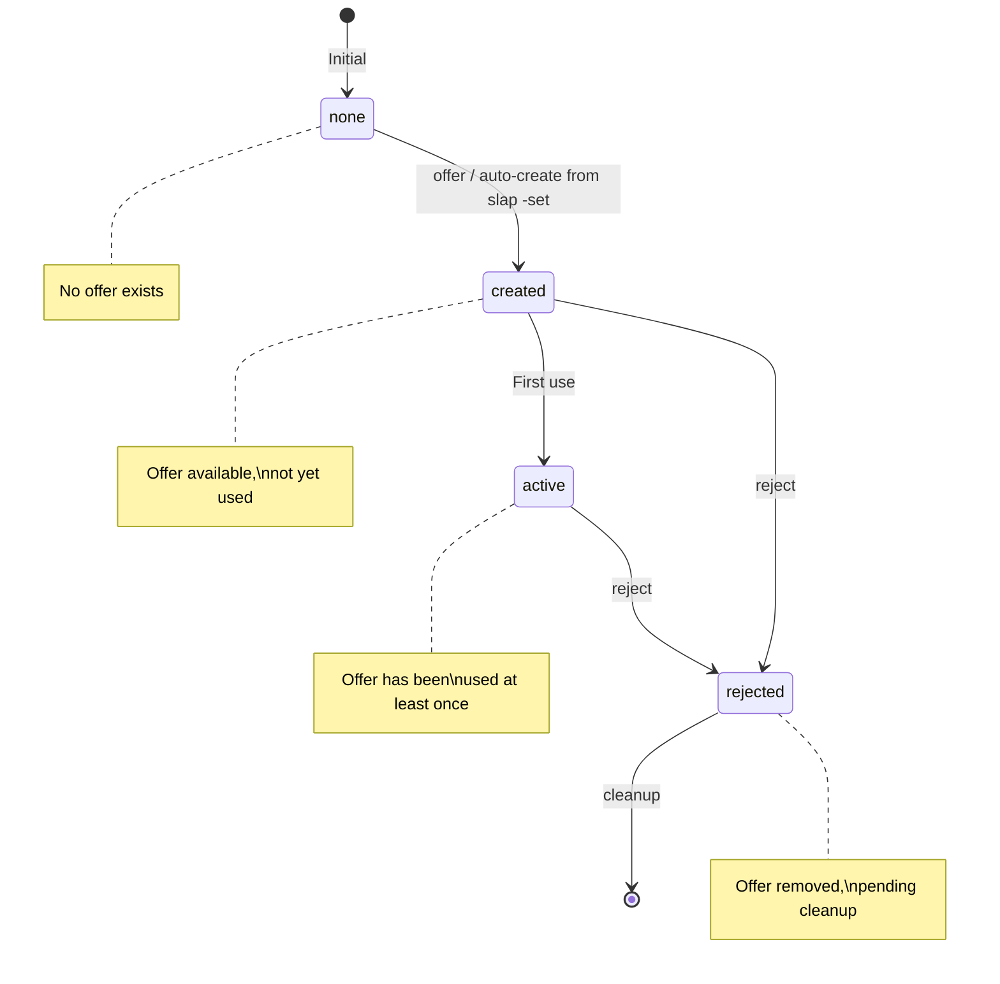

# State Machine Documentation

This document provides comprehensive documentation for the state machines that govern the lifecycle of defaults and offers in the vince CLI. Each entity follows a well-defined state machine with explicit transitions, triggers, and side effects.

> [!NOTE]
> For error codes referenced in this document, see [errors.md](errors.md). For definition tables, see [tables.md](tables.md).

## Overview

The vince CLI manages two primary entities with distinct lifecycles:

| Entity | Description | States | sid |
|--------|-------------|--------|-----|
| Default | Association between an application and file extension | none, pending, active, removed | def |
| Offer | Custom shortcut/alias for quick access to a default | none, created, active, rejected | off |

### State Machine Principles

1. **Explicit Transitions**: Every state change requires a specific trigger (command)
2. **Validation**: Transitions are validated before execution
3. **Side Effects**: State changes may trigger additional operations (backups, cleanup)
4. **Error Handling**: Invalid transitions produce specific error codes

## Default Lifecycle

The Default entity represents an association between an application executable and a file extension. Defaults progress through a defined lifecycle from creation to potential removal.

### Default States

| State | sid | Description | Entry Condition |
|-------|-----|-------------|-----------------|
| none | def-none | No default exists for the extension | Initial state / after cleanup |
| pending | def-pend | Default identified but not yet set as active | `slap` without `-set` flag |
| active | def-actv | Default is set and actively used | `slap -set` or `set` command |
| removed | def-rmvd | Default was removed but record retained | `chop` or `forget` command |

### Default State Descriptions

#### none

The initial state where no default association exists for a given file extension.

- **Characteristics**: No entry in defaults.json for the extension
- **Valid Actions**: `slap`, `set`
- **Invalid Actions**: `chop`, `forget` (produces VE302)

#### pending

A transitional state where an application has been associated with an extension but not yet activated.

- **Characteristics**: Entry exists in defaults.json with `state: "pending"`
- **Valid Actions**: `slap -set`, `set`, `chop`, `forget`
- **Use Case**: Preview association before committing

#### active

The operational state where the default is set and ready for use.

- **Characteristics**: Entry exists in defaults.json with `state: "active"`
- **Valid Actions**: `chop`, `forget`
- **Invalid Actions**: `slap` without removing first (produces VE301)

#### removed

A soft-delete state where the default was removed but the record is retained for potential restoration.

- **Characteristics**: Entry exists in defaults.json with `state: "removed"`
- **Valid Actions**: `slap -set`, `set` (restores to active)
- **Cleanup**: Removed entries are purged during maintenance operations

### Default State Transitions

| From | To | Trigger | Conditions | Side Effects |
|------|-----|---------|------------|--------------|
| none | pending | `slap` | Path exists, extension valid | Creates defaults.json entry |
| none | active | `slap -set` / `set` | Path exists, extension valid | Creates entry, auto-creates offer |
| pending | active | `slap -set` / `set` | Entry exists | Updates state, auto-creates offer |
| pending | none | `chop` / `forget` | Entry exists | Removes entry from defaults.json |
| active | removed | `chop` / `forget` | Entry exists | Updates state, retains record |
| removed | active | `slap -set` / `set` | Entry exists, path valid | Updates state, updates timestamp |

### Default Transition Details

#### none → pending

**Trigger:** `slap /path/to/app --ext`

**Conditions:**
- Application path must exist and be executable
- Extension must be valid and supported
- No existing default for the extension

**Side Effects:**
- Creates new entry in defaults.json
- Sets `state: "pending"`
- Records `created_at` timestamp

**Example:**
```bash
vince slap /usr/bin/code --md
# Creates pending default for .md files
```

#### none → active

**Trigger:** `slap /path/to/app -set --ext` or `set /path/to/app --ext`

**Conditions:**
- Application path must exist and be executable
- Extension must be valid and supported
- No existing active default for the extension

**Side Effects:**
- Creates new entry in defaults.json
- Sets `state: "active"`
- Records `created_at` timestamp
- Auto-creates offer entry in offers.json

**Example:**
```bash
vince slap /usr/bin/code -set --md
# Creates active default and offer for .md files
```

#### pending → active

**Trigger:** `slap -set --ext` or `set /path/to/app --ext`

**Conditions:**
- Pending entry must exist for the extension
- Application path must still be valid

**Side Effects:**
- Updates `state` to "active"
- Records `updated_at` timestamp
- Auto-creates offer entry if not exists

**Example:**
```bash
vince slap /usr/bin/code -set --md
# Activates pending default for .md files
```

#### pending → none

**Trigger:** `chop --ext` or `forget --ext`

**Conditions:**
- Pending entry must exist for the extension

**Side Effects:**
- Removes entry from defaults.json
- No offer cleanup needed (none created for pending)

**Example:**
```bash
vince chop --md
# Removes pending default for .md files
```

#### active → removed

**Trigger:** `chop --ext` or `forget --ext`

**Conditions:**
- Active entry must exist for the extension

**Side Effects:**
- Updates `state` to "removed"
- Records `updated_at` timestamp
- Associated offers remain (can be rejected separately)

**Example:**
```bash
vince forget --md
# Marks active default as removed
```

#### removed → active

**Trigger:** `slap -set --ext` or `set /path/to/app --ext`

**Conditions:**
- Removed entry must exist for the extension
- Application path must be valid (can be same or different)

**Side Effects:**
- Updates `state` to "active"
- Updates `application_path` if different
- Records `updated_at` timestamp

**Example:**
```bash
vince set /usr/bin/vim --md
# Restores removed default with new application
```

### Default State Diagram


## Offer Lifecycle

The Offer entity represents a custom shortcut or alias that provides quick access to a default association. Offers can be manually created or auto-generated when a default is activated.

### Offer States

| State | sid | Description | Entry Condition |
|-------|-----|-------------|-----------------|
| none | off-none | No offer exists with the given ID | Initial state / after cleanup |
| created | off-crtd | Offer created but not yet used | `offer` command or auto-create |
| active | off-actv | Offer has been used at least once | First use of the offer |
| rejected | off-rjct | Offer was rejected/removed | `reject` command |

### Offer State Descriptions

#### none

The initial state where no offer exists with the specified identifier.

- **Characteristics**: No entry in offers.json for the offer_id
- **Valid Actions**: `offer`, auto-create from `slap -set`
- **Invalid Actions**: `reject` (produces VE104)

#### created

A state where the offer has been created but not yet used.

- **Characteristics**: Entry exists in offers.json with `state: "created"`
- **Valid Actions**: Use the offer, `reject`
- **Use Case**: Offer is available but usage not yet tracked

#### active

The operational state where the offer has been used at least once.

- **Characteristics**: Entry exists in offers.json with `state: "active"`
- **Valid Actions**: `reject`
- **Tracking**: Usage count may be tracked for analytics

#### rejected

A terminal state where the offer has been rejected and is no longer available.

- **Characteristics**: Entry exists in offers.json with `state: "rejected"`
- **Valid Actions**: Cleanup (removal from offers.json)
- **Recovery**: Must create new offer with same or different ID

### Offer State Transitions

| From | To | Trigger | Conditions | Side Effects |
|------|-----|---------|------------|--------------|
| none | created | `offer` / auto-create | offer_id valid, unique | Creates offers.json entry |
| created | active | First use | Offer exists | Updates state, records usage |
| created | rejected | `reject` | Offer exists | Updates state |
| active | rejected | `reject` | Offer exists, not in use | Updates state |

### Offer Transition Details

#### none → created

**Trigger:** `offer <offer_id> /path/to/app --ext` or auto-create from `slap -set`

**Conditions:**
- offer_id must match pattern `^[a-z][a-z0-9_-]{0,31}$`
- offer_id must not already exist
- offer_id must not be a reserved name
- Associated default must exist or be created simultaneously

**Side Effects:**
- Creates new entry in offers.json
- Sets `state: "created"`
- Records `created_at` timestamp
- Sets `auto_created: true` if from `slap -set`

**Example:**
```bash
vince offer mycode /usr/bin/code --md
# Creates offer "mycode" for .md files
```

#### created → active

**Trigger:** First use of the offer

**Conditions:**
- Offer must exist in created state
- Associated default must be active

**Side Effects:**
- Updates `state` to "active"
- Records first usage timestamp

**Example:**
```bash
# Using the offer activates it
vince mycode document.md
# Offer transitions from created to active
```

#### created → rejected

**Trigger:** `reject <offer_id>`

**Conditions:**
- Offer must exist in created state

**Side Effects:**
- Updates `state` to "rejected"
- Records rejection timestamp
- Entry retained for audit trail

**Example:**
```bash
vince reject mycode
# Rejects unused offer "mycode"
```

#### active → rejected

**Trigger:** `reject <offer_id>`

**Conditions:**
- Offer must exist in active state
- Offer must not be currently in use (VE304 if in use)

**Side Effects:**
- Updates `state` to "rejected"
- Records rejection timestamp
- With `.` flag: complete deletion including connections

**Example:**
```bash
vince reject mycode
# Rejects active offer "mycode"

vince reject mycode .
# Complete-deletes offer and all connections
```

### Offer State Diagram



## Invalid Transitions

Certain state transitions are not permitted and will result in specific error codes. Understanding these invalid transitions helps prevent runtime errors.

### Invalid Default Transitions

| Current State | Attempted Action | Error Code | Message | Recovery |
|---------------|------------------|------------|---------|----------|
| none | `chop` / `forget` | VE302 | No default set for {ext} | Use `slap` or `set` first |
| active | `slap` (without removing) | VE301 | Default already exists for {ext} | Use `chop` to remove first |
| active | `set` (same extension) | VE301 | Default already exists for {ext} | Use `chop` to remove first |

### Invalid Offer Transitions

| Current State | Attempted Action | Error Code | Message | Recovery |
|---------------|------------------|------------|---------|----------|
| none | `reject` | VE104 | Offer not found: {id} does not exist | Use `list -off` to see offers |
| active | `reject` (in use) | VE304 | Cannot reject: offer {id} is in use | Wait for usage to complete |
| created/active | `offer` (same ID) | VE303 | Offer already exists: {id} | Use different offer_id |

### Invalid Transition Diagram


### Error Handling for Invalid Transitions

When an invalid transition is attempted, the system:

1. **Validates** the current state before attempting the transition
2. **Returns** the appropriate error code with a descriptive message
3. **Suggests** recovery actions to guide the user
4. **Preserves** the current state (no partial changes)

**Example Error Output:**

```text
✗ VE301: Default already exists for .md
  Current state: active
  Application: /usr/bin/code
  
ℹ Use 'chop --md' to remove the existing default first
```

```text
✗ VE104: Offer not found: mycode does not exist

ℹ Use 'list -off' to see available offers
```

## Cross-References

- See [errors.md](errors.md) for complete error code documentation
- See [schemas.md](schemas.md) for defaults.json and offers.json schemas
- See [api.md](api.md) for command interface specifications
- See [tables.md](tables.md) for STATES table definitions
